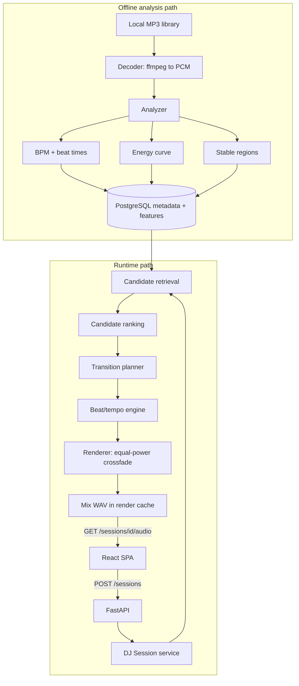

# Architecture

Two paths, deliberately separated: expensive deterministic analysis happens offline when a track
enters the library, and the runtime path does database reads, small numerical scoring, and audio
rendering.

## Component boundaries

| Package | Responsibility | May depend on |
| --- | --- | --- |
| `autodj.audio` | Decode, BPM/beat detection, energy, stable regions | numpy/librosa only |
| `autodj.dj` | Candidate criteria, ranking, transition planning | feature dataclasses only |
| `autodj.render` | Time stretch, beat alignment, crossfade, mix rendering | `autodj.audio` |
| `autodj.metrics` | Transition quality metrics, latency instrumentation | numpy |
| `autodj.persistence` | SQLAlchemy models, repositories, migrations | SQLAlchemy |
| `autodj.services` | Orchestration of the above | everything |
| `autodj.api` | HTTP boundary | `autodj.services` |

`autodj.audio` and `autodj.dj` are pure: arrays and dataclasses in, values out. No database, no
HTTP. Enforced by the import-linter contracts in `pyproject.toml`, which run in CI.

`autodj.audio.decode` is the single exception to filesystem purity, and it is deliberate: ffmpeg
and ffprobe are external processes that read files from disk. Confining that boundary to one
module keeps beat, energy, and region analysis testable on arrays alone.

## Session tempo

The seed track's native BPM becomes the session tempo. Every later track is stretched once, for
its whole duration, by `session_bpm / native_bpm`, so its beat grid maps linearly (`t' = t /
stretch_factor`) and stays locked for as long as it plays. This removes drift from the runtime
path at the cost of restricting candidates to a narrow tempo band.

## Ingestion path (M1)

Ingestion is the only writer of the `tracks` table's source columns. A scan walks the library
directory, and for each audio file:

1. hashes the file contents (SHA-256, streamed) to detect changes across scans,
2. probes it with ffprobe for duration, sample rate, channels, codec, bit rate, and tags,
3. validates it by decoding a bounded window to mono float32 and checking for empty, non-finite,
   or effectively silent audio,
4. resolves a display title and artist, and
5. writes either a `PENDING` track row or a `FAILED` row carrying a structured `failure_reason`.

### Identity and `content_hash`

**A track is a path, not a recording.** `tracks.audio_path` (library-relative) is unique and is the
only way ingestion looks a file up. A re-scan therefore updates rows in place instead of
duplicating them.

`content_hash` answers exactly one question: did these bytes change since the last scan? Its index
is deliberately **not** unique, and no code path resolves a file through it. The consequences are
intentional:

- The same recording at two paths is **two tracks**. Deduplicating them would mean deciding which
  path wins, and silently dropping a file a user can see on disk is worse than a duplicate. A
  duplicate is also legitimate: the same audio can appear in a crate and a playlist folder.
- An unchanged hash on a previously successful track short-circuits before any subprocess runs,
  which makes repeat scans cheap. `--recheck` forces revalidation.
- Editing a file in place keeps its row and resets it to `PENDING`, because the path is unchanged.
- Moving a file adds a row for the new path and **leaves the old row behind**, since a scan only
  looks at files that exist. Pruning rows for vanished files is not in M1; that row keeps its
  `PENDING` status and a later analysis milestone will fail to read it.

### Validating audio

Validation proves a source is *decodable and structurally usable*. It deliberately does not judge
musical content, with one exception: a file with no audible samples anywhere is useless to a mixer.

A silent opening is not evidence of that. Ambient intros, long fade-ins and exports padded with
leading silence are all normal, so when the validation window turns out to be silent the check
widens to `ingestion.silence_scan_seconds` of audio and only rejects the file if that is silent
too. The second decode costs real time but runs only for the rare file whose first seconds are
quiet, which keeps the common path fast.

One bad file never stops a scan. Every failure mode is a named reason in
`autodj.audio.decode.SourceFailure`, persisted as JSONB so later milestones can report on it.

### Naming

Filenames in a real library are messy (`Drake - Nice For What (Lyrics).mp3`), so they are treated
as a source path first and a name only as a last resort. Embedded tags win when present; otherwise
the filename stem is sanitized conservatively. See `docs/algorithms.md`.

## Milestone status

- M0 project skeleton — complete
- M1 audio ingestion — complete
- M2-M15 — not started

Sections are filled in by the milestone that implements them.
