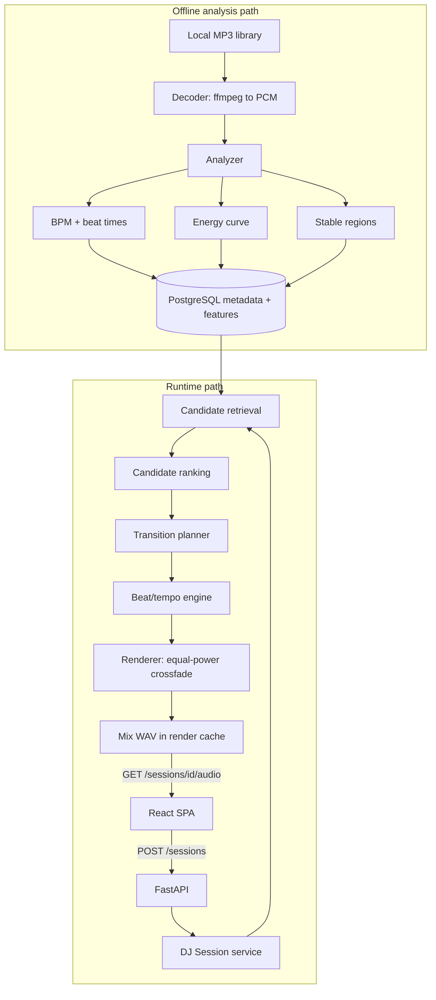

# Architecture

Two paths, deliberately separated: expensive deterministic analysis happens offline when a track
enters the library, and the runtime path does database reads, small numerical scoring, and audio
rendering.

## Component boundaries

| Package | Responsibility | May depend on |
| --- | --- | --- |
| `autodj.audio` | Decode, BPM/beat detection, energy, stable regions | numpy/librosa only |
| `autodj.dj` | Candidate criteria, ranking, transition planning | feature dataclasses only |
| `autodj.render` | Time stretch, beat alignment, crossfade, mix rendering | `autodj.audio` |
| `autodj.metrics` | Transition quality metrics, latency instrumentation | numpy |
| `autodj.persistence` | SQLAlchemy models, repositories, migrations | SQLAlchemy |
| `autodj.services` | Orchestration of the above | everything |
| `autodj.api` | HTTP boundary | `autodj.services` |

`autodj.audio` and `autodj.dj` are pure: arrays and dataclasses in, values out. No database, no
HTTP. Enforced by the import-linter contracts in `pyproject.toml`, which run in CI.

`autodj.audio.decode` is the single exception to filesystem purity, and it is deliberate: ffmpeg
and ffprobe are external processes that read files from disk. Confining that boundary to one
module keeps beat, energy, and region analysis testable on arrays alone.

## Session tempo

V1's **initial default** is that the seed track's native BPM becomes the session tempo. That
is a starting policy, not a permanent restriction: a later milestone may pick a different
constant session tempo. What stays fixed in V1 is the *shape* of the adjustment — one
pitch-preserving stretch per track, constant for its whole duration, bounded by
`tempo.min_stretch_ratio` / `tempo.max_stretch_ratio` (±5%). The beat grid then maps linearly
(`t' = t / stretch_factor`) and stays locked for as long as the track plays. Continuous tempo
ramps are out of scope. Retrieval (M4) must never propose a track that would break this bound.

## Ingestion path (M1)

Ingestion is the only writer of the `tracks` table's source columns. A scan walks the library
directory, and for each audio file:

1. hashes the file contents (SHA-256, streamed) to detect changes across scans,
2. probes it with ffprobe for duration, sample rate, channels, codec, bit rate, and tags,
3. validates it by decoding a bounded window to mono float32 and checking for empty, non-finite,
   or effectively silent audio,
4. resolves a display title and artist, and
5. writes either a `PENDING` track row or a `FAILED` row carrying a structured `failure_reason`.

### Identity and `content_hash`

**A track is a path, not a recording.** `tracks.audio_path` (library-relative) is unique and is the
only way ingestion looks a file up. A re-scan therefore updates rows in place instead of
duplicating them.

`content_hash` answers exactly one question: did these bytes change since the last scan? Its index
is deliberately **not** unique, and no code path resolves a file through it. The consequences are
intentional:

- The same recording at two paths is **two tracks**. Deduplicating them would mean deciding which
  path wins, and silently dropping a file a user can see on disk is worse than a duplicate. A
  duplicate is also legitimate: the same audio can appear in a crate and a playlist folder.
- An unchanged hash on a previously successful track short-circuits before any subprocess runs,
  which makes repeat scans cheap. `--recheck` forces revalidation.
- Editing a file in place keeps its row and resets it to `PENDING`, because the path is unchanged.
- Moving a file adds a row for the new path and **leaves the old row behind**, since a scan only
  looks at files that exist. Pruning rows for vanished files is not in M1; that row keeps its
  `PENDING` status and a later analysis milestone will fail to read it.

### Validating audio

Validation proves a source is *decodable and structurally usable*. It deliberately does not judge
musical content, with one exception: a file with no audible samples anywhere is useless to a mixer.

A silent opening is not evidence of that. Ambient intros, long fade-ins and exports padded with
leading silence are all normal, so when the validation window turns out to be silent the check
widens to `ingestion.silence_scan_seconds` of audio and only rejects the file if that is silent
too. The second decode costs real time but runs only for the rare file whose first seconds are
quiet, which keeps the common path fast.

One bad file never stops a scan. Every failure mode is a named reason in
`autodj.audio.decode.SourceFailure`, persisted as JSONB so later milestones can report on it.

### Naming

Filenames in a real library are messy (`Drake - Nice For What (Lyrics).mp3`), so they are treated
as a source path first and a name only as a last resort. Embedded tags win when present; otherwise
the filename stem is sanitized conservatively. See `docs/algorithms.md`.

## Analysis path (M2)

Analysis is the only writer of `tracks.native_bpm`, `tracks.analysis_confidence`,
`tracks.analysis_version`, and the `track_analysis` table. It reads rows that ingestion has
already validated, decodes each file once to mono PCM at `analysis.sample_rate`, and runs the
pure beat tracker in `autodj.audio.beats`.

Queryable tempo and quality stay on `tracks` so later retrieval can filter without loading a
beat grid. `analysis_confidence` is a heuristic quality score in [0, 1], not a probability
that the BPM is correct. The grid and the diagnostics that produced those two numbers live on
`track_analysis` (1:1, cascaded delete): refined timestamps, beat count, the hops and sample
rate used, median IBI, IBI CV, onset contrast, and which octave of the raw librosa grid was
kept. The onset envelope is not stored; it is large and regenerable.

Status moves `PENDING` → `PROCESSING` → `COMPLETE` or `FAILED`. `PROCESSING` is committed
before the decode so a crash mid-file is retried on the next run: the default queue is
PENDING, PROCESSING, and stale-version COMPLETE. A row left in PROCESSING is selected and
analysed again without `--reanalyze`. `COMPLETE` rows whose
`analysis_version` does not match the current config are reprocessed without `--reanalyze`.
`--reanalyze` also redoes current COMPLETE and FAILED rows. Ingestion of a changed file
resets the three analysis columns, deletes the `track_analysis` row, and returns the track to
`PENDING`.

One bad file never stops the batch. Decode failures reuse the M1 `SourceFailure` reasons;
beat-tracking failures use `AnalysisFailure`; a vanished path is `MISSING_FILE`.

## Scaling

The working library is about 150–200 tracks. At that size, PostgreSQL filters on analysis
status, `native_bpm`, and energy are enough; there is no ANN or vector index in V1.

A design that had to reach ~100k tracks would add indexes on those structured columns, a
background queue for analysis and render, object storage for mix WAVs, and vector/ANN search
only if high-dimensional semantic features actually appeared. That evolution is a note, not a
milestone. See `docs/roadmap.md`.

## Milestone status

- M0 project skeleton — complete
- M1 audio ingestion — complete
- M2 BPM and beat-grid analysis — complete
- M3 musical features and stable regions — not started
- M4 candidate selection and transition planning — not started
- M5 tempo/beat sync and audio rendering — not started
- M6 evaluation and algorithm improvements — not started
- M7 DJ session runtime and demo application — not started
- M8 reliability, performance, and polish — not started

The authoritative plan, including the old 16-step mapping, is `docs/roadmap.md`. Sections
below are filled in by the milestone that implements them.
