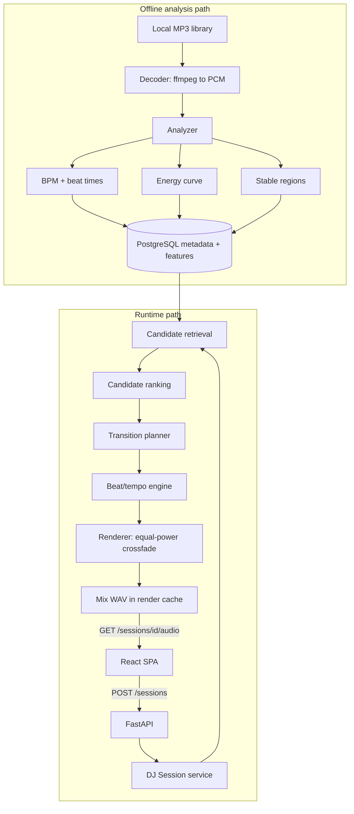

# Architecture

Two paths, deliberately separated: expensive deterministic analysis happens offline when a track
enters the library, and the runtime path does database reads, small numerical scoring, and audio
rendering.

## Component boundaries

| Package | Responsibility | May depend on |
| --- | --- | --- |
| `autodj.audio` | Decode, BPM/beat detection, energy, stable regions | numpy/librosa only |
| `autodj.dj` | Candidate criteria, ranking, transition planning | feature dataclasses only |
| `autodj.render` | Time stretch, beat alignment, crossfade, mix rendering | `autodj.audio` |
| `autodj.metrics` | Transition quality metrics, latency instrumentation | numpy |
| `autodj.persistence` | SQLAlchemy models, repositories, migrations | SQLAlchemy |
| `autodj.services` | Orchestration of the above | everything |
| `autodj.api` | HTTP boundary | `autodj.services` |

`autodj.audio` and `autodj.dj` are pure: arrays and dataclasses in, values out. No database, no
HTTP, no filesystem. Enforced by the import-linter contracts in `pyproject.toml`, which run in CI.

## Session tempo

The seed track's native BPM becomes the session tempo. Every later track is stretched once, for
its whole duration, by `session_bpm / native_bpm`, so its beat grid maps linearly (`t' = t /
stretch_factor`) and stays locked for as long as it plays. This removes drift from the runtime
path at the cost of restricting candidates to a narrow tempo band.

## Milestone status

- M0 project skeleton — in progress
- M1-M15 — not started

Sections are filled in by the milestone that implements them.
