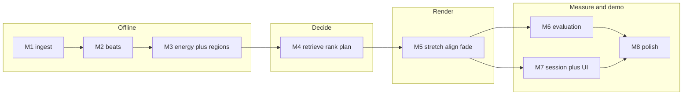

# AutoDJ V1 roadmap

Nine milestones (M0–M8). This file is the only authoritative implementation plan.
Earlier notes that spoke of 16 milestones (M0–M15) are obsolete; see the mapping at
the end.

One milestone per branch, PR, and agent conversation. The repo — this file, `AGENTS.md`,
architecture/algorithm/parameter docs, code, tests, migrations, and git history — is the
durable context. A fresh agent should not need prior chat transcripts.

## Status

| Milestone | Name | Status |
| --- | --- | --- |
| M0 | Foundation | complete |
| M1 | Audio ingestion | complete |
| M2 | BPM and beat-grid analysis | complete |
| M3 | Musical features and stable transition regions | not started |
| M4 | Candidate selection and transition planning | not started |
| M5 | Tempo/beat synchronization and audio rendering | not started |
| M6 | Evaluation and algorithm improvements | not started |
| M7 | DJ session runtime and demo application | not started |
| M8 | Reliability, performance, and production polish | not started |



## Principles that survive compression

- Offline analysis is separate from runtime DJ decisions.
- Source files stay compressed and read-only; decode to PCM when processing.
- Track-level features (BPM, energy scalar, confidence) are distinct from temporal
  features (beat grid, energy curve, regions).
- Retrieval, ranking, and transition-window selection stay separate functions even
  when they ship in one milestone.
- Cost functions are explicit; weights are config hypotheses until an experiment
  changes them.
- Failures are named and persisted. Feature-format changes bump `analysis.version`.
- Tests travel with the feature they validate. Automated tests never need the private
  library.

## Complete milestones (do not renumber)

### M0 — Foundation

Project skeleton, YAML settings, health API, structured logging, Alembic/Postgres,
CI, and the `lint-imports` layering contracts.

### M1 — Audio ingestion

Scan a library into validated `tracks` rows: content hash, ffprobe, bounded decode,
naming, `PENDING` / `FAILED`. CLI: `scripts/ingest_library.py`.

### M2 — BPM and beat-grid analysis

librosa BPM and beat times on mono PCM at 22.05 kHz, octave scoring with a weak 124
prior (exact-score ties only), sub-frame parabolic refinement, heuristic
`analysis_confidence` (quality score, not a probability), `track_analysis`, analysis
service and CLI, and the 22.05 vs 44.1 kHz experiment. Scope is closed; do not fold
energy or later work back into M2.

## Remaining milestones

### M3 — Musical features and stable transition regions

**Goal.** Finish the offline analysis path: a per-track energy signal and mixable
32-beat windows.

**Inputs.** M1 source files; M2 `native_bpm`, beat grid, onset diagnostics,
`analysis.version`.

**Deliverables.** `autodj.audio` energy and region modules; extend the existing
analysis service and `analyze_library.py`; persist an aggregated energy scalar on
`tracks` and the curve plus regions on `track_analysis` (or a small child table);
bump `analysis.version` and state the reprocess implication; record the energy
aggregation experiment (mean / median / p90) and region-threshold calibration in
`docs/experiments.md`.

**Algorithms.** Map RMS (dBFS window) and onset strength onto **comparable `[0, 1]`
scales before** combining them as `E(t) = α·R(t) + (1-α)·O(t)`. Do not add a raw
dBFS number to a raw onset number. Store the curve at 10 Hz. Scale tracks for
cross-library comparison with robust 5th/95th percentiles. Detect regions with
32-beat windows stepped 4 beats, gated on IBI CV, in-tolerance fraction, and onset
floor; score survivors and reduce with non-maximum suppression to at most 8 regions.

**Non-goals.** Ranking, planning, time stretch, UI, key or harmonic analysis.

**Split later if** region calibration cannot start until energy defaults are settled
*and* that debate consumes the whole conversation.

### M4 — Candidate selection and transition planning

**Goal.** From a playing track, choose the next track **and** the exit/enter windows.
No audio is written.

**Inputs.** M2/M3 features and stable regions.

**Deliverables.** Three pure modules in `autodj.dj` — retrieve, rank, plan — composed
by a service or CLI. Weights stay in `default.yaml`.

Keep the three questions distinct in code:

1. Retrieval — which tracks are plausible?
2. Ranking — which plausible next track is best?
3. Planning — where should A exit and B enter?

**Algorithms.** Retrieval: analysis complete, unplayed, BPM band, energy delta, has a
stable region. Ranking: weighted tempo / energy / quality cost. Planning: enumerate
outgoing `[0.65, 0.95]` × incoming `[0.0, 0.35]` region pairs; cost = stability,
local energy gap, required stretch, position; pick the cheapest valid pair.

**Hard stretch bound.** M5 will refuse a stretch outside
`tempo.min_stretch_ratio` / `tempo.max_stretch_ratio` (±5%). M4 must never select a
track or a pair that would require more adjustment than that. Any retrieval
relaxation beyond the first BPM filter is still capped by the same bound. A looser
filter that proposes an unrenderable mix is a bug. The current
`retrieval.relaxed_bpm_deviation_pct: 7.0` hypothesis exceeds ±5% and must be
tightened or dropped when M4 lands.

**Non-goals.** Rubber Band, WAV output, sessions API, lookahead, learned weights.

**Split later if** pair-search or retrieval relaxation cannot be reviewed in the
same diff as ranking.

### M5 — Tempo/beat synchronization and audio rendering

**Goal.** Turn a transition plan into a stereo 16-bit PCM WAV: one constant
pitch-preserving stretch, phase alignment, equal-power crossfade.

**Inputs.** M4 `TransitionPlan`, M2 beat grids, source paths.

**Deliverables.** `autodj.render`: `TimeStretcher` (pedalboard / Rubber Band),
aligner, equal-power fade, mix writer; files under `AUTODJ_RENDER_CACHE_DIR`;
peak/clip flags. Prefer creating the `transitions` table here so M6 can attach
metrics. `rubberband_cli` and `phase_vocoder` remain documented swap paths, not
required implementations.

**Session tempo.** The seed track’s native BPM is the **initial V1 default** for
session tempo, not a permanent architectural restriction. V1 stretches each admitted
track once, constantly, by `session_bpm / native_bpm` inside `[0.95, 1.05]`, then
remaps its beat grid linearly (`t' = t / stretch`). Continuous tempo ramps are out
of scope. A later policy could choose a different constant session tempo; it would
still be bounded, still pitch-preserving, and still not a ramp.

**Non-goals.** Session loop, UI, model-ladder experiments, continuous/ramped tempo
automation.

**Split later if** pedalboard plus alignment plus fade cannot land as one reviewable
PR (then stretch+align, then fade+write).

### M6 — Evaluation and algorithm improvements

**Goal.** Show whether the planner and renderer help, using the model ladder and
recorded metrics. Change defaults only when an experiment says so.

**Deliverables.** `autodj.metrics`; eval scripts; metric columns on `transitions`;
results in `docs/evaluation.md` and `docs/experiments.md`; excerpt exporter for
blind A/B (tooling is the merge gate; running listeners is the owner’s follow-up).

**Comparisons.** Baseline A random; Baseline B nearest-BPM + edge fade; Model C
BPM+energy rank; Model D full planner + alignment. Metrics: BPM delta, stretch %,
measured alignment error (onset cross-correlation in the overlap), energy
discontinuity, region stability, success/failure rates, latency percentiles,
analysis fail rate.

**Stretch, not default:** bounded lookahead / beam search, only if greedy
sequencing shows a real set-level failure.

**Non-goals.** UI; new infrastructure; mandatory lookahead.

### M7 — DJ session runtime and demo application

**Goal.** Start a session from a seed track and hear a mix in the browser.

**Deliverables.** Session service (default length 6, unplayed set, session tempo);
`POST /sessions`, `GET /sessions/{id}`, `GET /sessions/{id}/audio`; pre-render the
set or one track ahead (not a live stream); thin React/Vite page with native
`<audio>`. CLI session runner is the acceptance floor; the page should still land
in this milestone if it stays one screen.

**Non-goals.** WebSockets, chunked live streaming, auth, multi-user, ANN, extra
deploy platforms.

**Split later if** the API/session loop is already a full PR and React scaffolding
would bury the review (UI as a fast follow, still M7 — not a new major milestone).

### M8 — Reliability, performance, and production polish

**Goal.** Make the demo honest and repeatable. Fix only what measurement shows.

**Deliverables.** Observability gaps if any; analysis/runtime failure hygiene;
config/docs consistency; reproducibility from `config_snapshot` + seed; README demo
path; optional use of the existing Compose stack. Performance work only against M6
p95.

**Non-goals.** Kubernetes, Kafka, Redis, vector databases, distributed workers,
rewriting working algorithms.

Keep this milestone short if M3–M7 already left nothing real.

## Scaling notes (not milestones)

The working library is about 150–200 tracks. At that size, SQL filters on status,
BPM, and energy are enough. A design that had to reach ~100k tracks would add
indexes, a background analysis/render queue, object storage for WAVs, and ANN /
vector search only if high-dimensional semantic features appeared. Document that
evolution; do not build it in V1.

## Old 16-step plan → this roadmap

```text
old M0  Foundation                         → M0  (complete, unchanged)
old M1  Audio ingestion                    → M1  (complete, unchanged)
old M2  BPM + beat-grid analysis           → M2  (complete, unchanged scope)
old M3  Energy analysis                    → M3
old M4  Stable rhythmic regions            → M3
old M5  Equal-power crossfade              → M5
old M6  Tempo stretch + phase alignment    → M5
old M7  Candidate retrieval                → M4
old M8  Candidate ranking                  → M4
old M9  Transition planning                → M4
old M10 Metrics / transitions table *      → M6 (schema may start in M5)
old M11 Session / mix loop *               → M7
old M12 Human evaluation                   → M6 (tooling; listening is follow-up)
old M13 Lookahead / beam search            → M6 stretch only, if greedy fails
old M14 API + React SPA *                  → M7
old M15 Reliability / polish *             → M8
```

`*` was never named in the old repo docs; the mapping is inferred from the
architecture diagram and empty packages.

Optional / not required for V1: lookahead/beam; extra stretch backends beyond
pedalboard; extra deploy platforms. Key/harmonic analysis was never in V1.
